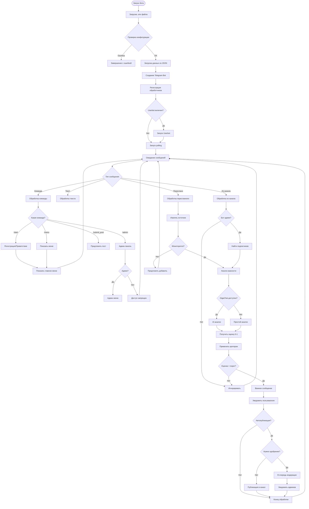
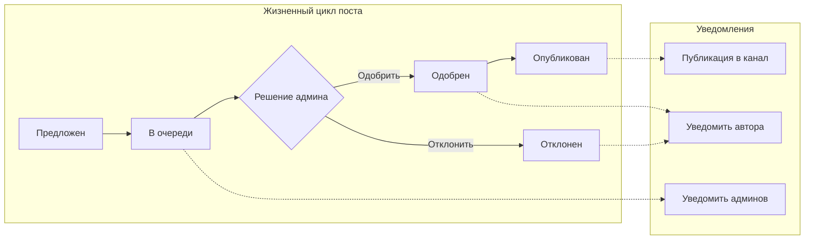
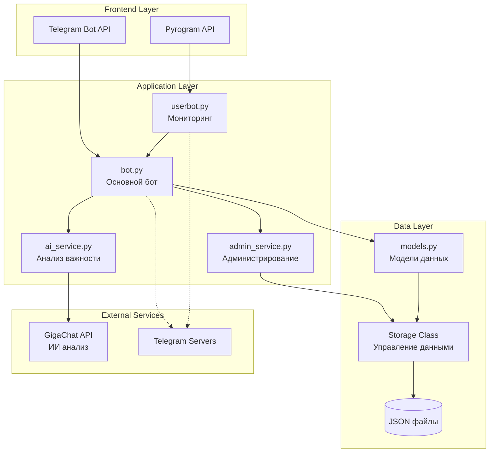
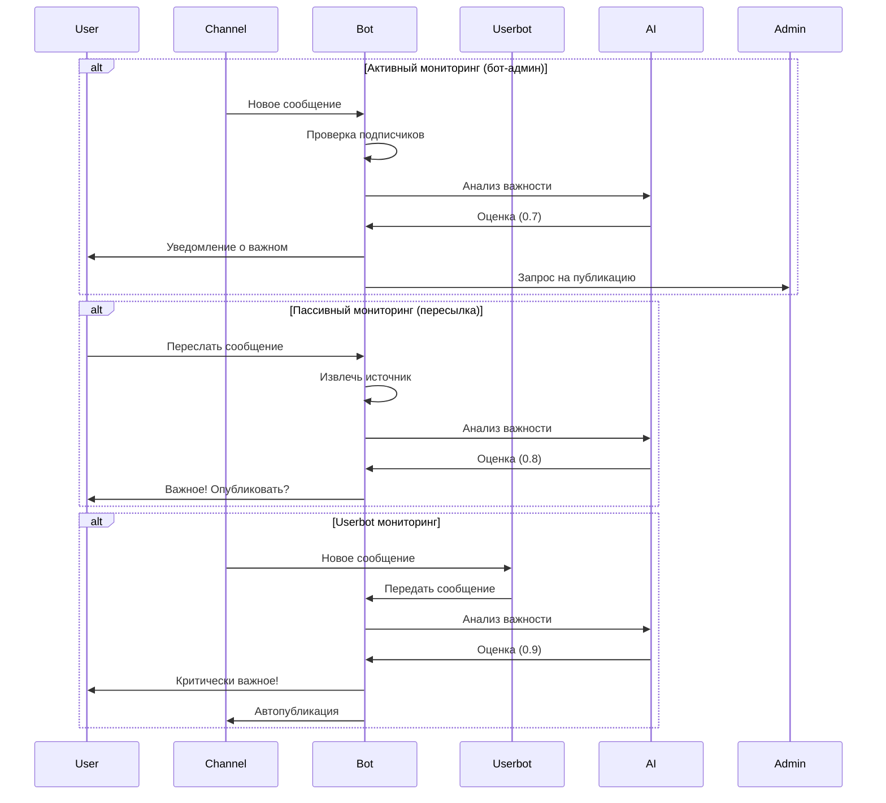
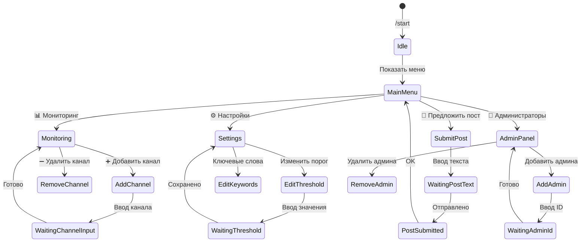
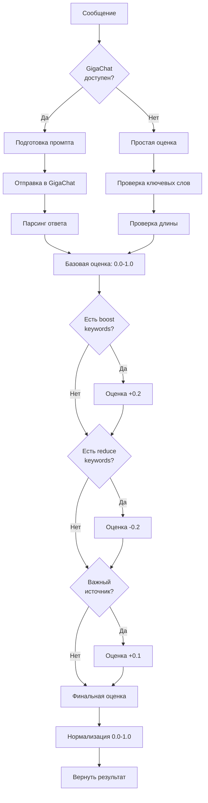

# 🔄 Визуальная схема алгоритма работы бота

## Основной поток обработки сообщений

## Процесс модерации постов

## Архитектура компонентов

## Поток данных при мониторинге

## Состояния пользователя

## Алгоритм оценки важности

