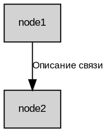

# 📊 Диаграммы алгоритма работы Telegram бота

Этот раздел содержит подробные схемы, описывающие алгоритм работы бота для мониторинга важных сообщений.

## 📋 Список диаграмм

### 1. `bot_algorithm_diagram.dot` - Основной алгоритм работы бота
**Описание**: Полная схема работы системы, включающая все основные процессы от запуска до публикации сообщений.

**Что показывает**:
- Инициализацию системы
- Разделение пользователей на администраторов и обычных пользователей
- Два режима мониторинга (пассивный и активный)
- Процесс AI анализа важности
- Систему модерации с inline кнопками
- Userbot функциональность

### 2. `ai_analysis_diagram.dot` - Детальный процесс AI анализа
**Описание**: Схема процесса анализа важности сообщений с помощью GigaChat API.

**Что показывает**:
- Предобработку сообщений
- Формирование промптов для ИИ
- Взаимодействие с GigaChat API
- Применение критериев важности
- Примеры ключевых слов
- Результаты анализа

### 3. `system_architecture.dot` - Архитектура системы
**Описание**: Схема архитектуры системы, показывающая взаимодействие всех компонентов.

**Что показывает**:
- Внешние системы (Telegram, GigaChat)
- Основные компоненты системы
- Модули и сервисы
- Хранилища данных
- Выходные каналы

### 4. `moderation_flow.dot` - Процесс модерации
**Описание**: Детальная схема процесса модерации постов с inline кнопками.

**Что показывает**:
- Создание постов
- Уведомления администраторов
- Inline кнопки модерации
- Процесс одобрения/отклонения
- Публикацию результатов

## 🛠️ Генерация диаграмм

### Требования
- Установленный Graphviz
- Поддержка русского языка в шрифтах

### Установка Graphviz

#### macOS
```bash
brew install graphviz
```

#### Ubuntu/Debian
```bash
sudo apt-get install graphviz
```

#### Windows
```bash
# Через Chocolatey
choco install graphviz

# Или скачать с официального сайта
# https://graphviz.org/download/
```

### Команды для генерации

#### PNG изображения
```bash
# Основной алгоритм
dot -Tpng bot_algorithm_diagram.dot -o bot_algorithm.png

# AI анализ
dot -Tpng ai_analysis_diagram.dot -o ai_analysis.png

# Архитектура системы
dot -Tpng system_architecture.dot -o system_architecture.png

# Процесс модерации
dot -Tpng moderation_flow.dot -o moderation_flow.png
```

#### SVG изображения (рекомендуется для веб)
```bash
# Основной алгоритм
dot -Tsvg bot_algorithm_diagram.dot -o bot_algorithm.svg

# AI анализ
dot -Tsvg ai_analysis_diagram.dot -o ai_analysis.svg

# Архитектура системы
dot -Tsvg system_architecture.dot -o system_architecture.svg

# Процесс модерации
dot -Tsvg moderation_flow.dot -o moderation_flow.svg
```

#### PDF документы
```bash
# Основной алгоритм
dot -Tpdf bot_algorithm_diagram.dot -o bot_algorithm.pdf

# AI анализ
dot -Tpdf ai_analysis_diagram.dot -o ai_analysis.pdf

# Архитектура системы
dot -Tpdf system_architecture.dot -o system_architecture.pdf

# Процесс модерации
dot -Tpdf moderation_flow.dot -o moderation_flow.pdf
```

### Скрипт для массовой генерации

Создайте файл `generate_diagrams.sh`:

```bash
#!/bin/bash

# Создаем папку для изображений
mkdir -p diagrams

# Генерируем все диаграммы в разных форматах
for file in *.dot; do
    base_name=$(basename "$file" .dot)
    
    echo "Генерация диаграммы: $base_name"
    
    # PNG
    dot -Tpng "$file" -o "diagrams/${base_name}.png"
    
    # SVG
    dot -Tsvg "$file" -o "diagrams/${base_name}.svg"
    
    # PDF
    dot -Tpdf "$file" -o "diagrams/${base_name}.pdf"
done

echo "Все диаграммы сгенерированы в папке diagrams/"
```

Сделайте скрипт исполняемым и запустите:
```bash
chmod +x generate_diagrams.sh
./generate_diagrams.sh
```

## 📖 Использование в презентации

### Включение в Markdown
```markdown


```

### Включение в PowerPoint/Keynote
1. Сгенерируйте PNG изображения
2. Вставьте как обычные изображения
3. При необходимости измените размер

### Включение в веб-документацию
Используйте SVG формат для лучшего качества:
```html

```

## 🎨 Настройка стилей

### Изменение цветов
В файлах `.dot` можно изменить цвета, заменив значения `fillcolor`:

```dot
// Примеры цветов
fillcolor=lightblue    // Светло-синий
fillcolor=lightgreen   // Светло-зеленый
fillcolor=lightyellow  // Светло-желтый
fillcolor=lightcoral   // Светло-коралловый
fillcolor=lightpink    // Светло-розовый
fillcolor=orange       // Оранжевый
fillcolor=yellow       // Желтый
```

### Изменение размеров
```bash
# Увеличение размера
dot -Tpng -Gsize=12,8 bot_algorithm_diagram.dot -o bot_algorithm_large.png

# Установка DPI
dot -Tpng -Gdpi=300 bot_algorithm_diagram.dot -o bot_algorithm_hd.png
```

## 🔧 Редактирование диаграмм

### Рекомендуемые инструменты
1. **Visual Studio Code** с расширением Graphviz
2. **Graphviz Online** - https://dreampuf.github.io/GraphvizOnline/
3. **Draw.io** - для создания дополнительных схем

### Структура файлов .dot


## 📝 Примечания

1. **Шрифты**: Убедитесь, что система поддерживает русские шрифты
2. **Размеры**: Для презентаций используйте высокое разрешение (300 DPI)
3. **Форматы**: SVG лучше для веб, PNG для презентаций, PDF для печати
4. **Версионирование**: Сохраняйте исходные .dot файлы в Git

## 🆘 Устранение проблем

### Проблема с русскими символами
```bash
# Установите шрифт с поддержкой кириллицы
dot -Tpng -Gfontname="DejaVu Sans" bot_algorithm_diagram.dot -o bot_algorithm.png
```

### Слишком большие изображения
```bash
# Уменьшите размер
dot -Tpng -Gsize=8,6 bot_algorithm_diagram.dot -o bot_algorithm_small.png
```

### Проблемы с отображением
```bash
# Проверьте синтаксис
dot -Tsvg bot_algorithm_diagram.dot -o /dev/null
```

## 📞 Поддержка

При возникновении проблем с генерацией диаграмм:
1. Проверьте установку Graphviz: `dot -V`
2. Убедитесь в корректности синтаксиса .dot файлов
3. Проверьте поддержку шрифтов в системе 