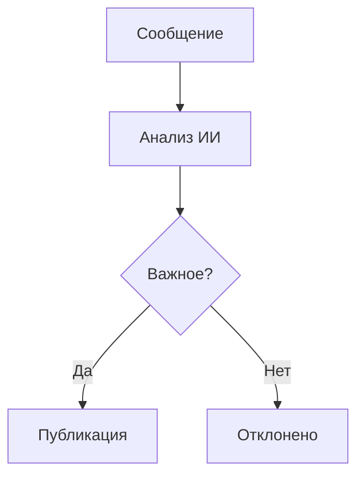
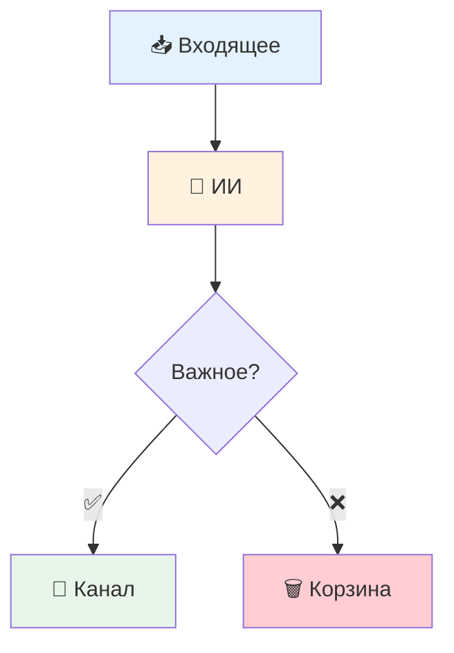
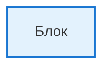

# Диаграммы Mermaid для алгоритма работы бота

## Доступные версии

### 1. `bot_algorithm_simple.mmd` - Полная детальная схема
- ✅ Все компоненты и процессы
- 📊 Подробные примеры
- 🎨 Цветовая дифференциация
- 📖 Легенда и временные метки
- **Использовать для:** документации, обучения

### 2. `bot_algorithm_simplified.mmd` - Упрощенная линейная схема
- ✅ Основной поток от начала до конца
- 📱 Простые примеры
- 🎯 Фокус на главном процессе
- **Использовать для:** быстрого понимания

### 3. `bot_algorithm_user_flow.mmd` - Схема по ролям
- 👤 Действия пользователя
- 👮 Действия администратора
- 🤖 Автоматические процессы
- **Использовать для:** обучения разных групп пользователей

### 4. `bot_algorithm_compact.mmd` - Компактная схема
- 📌 Минимум блоков
- ⚡ Быстрый обзор
- 📊 Ключевые примеры
- **Использовать для:** презентаций, слайдов

## Как использовать

### Вариант 1: Онлайн редактор Mermaid
1. Откройте [mermaid.live](https://mermaid.live/)
2. Скопируйте код из нужного `.mmd` файла
3. Вставьте в левую панель
4. Справа появится диаграмма
5. Экспортируйте в PNG/SVG через меню Actions

### Вариант 2: В документации GitHub
```markdown
```mermaid
// Вставьте сюда код из .mmd файла
```
```

### Вариант 3: В презентации
1. Экспортируйте диаграмму в PNG/SVG
2. Вставьте изображение в слайд
3. Или используйте плагины Mermaid для PowerPoint

### Вариант 4: Локальные инструменты
- **VS Code**: установите расширение "Mermaid Preview"
- **CLI**: `mmdc -i diagram.mmd -o diagram.png`
- **Python**: используйте библиотеку `python-mermaid`

## Примеры кода для вставки

### Минимальный пример


### С эмодзи и стилями


## Настройка внешнего вида

### Темы Mermaid
```mermaid
%%{init: {'theme':'default'}}%%
%%{init: {'theme':'dark'}}%%
%%{init: {'theme':'forest'}}%%
%%{init: {'theme':'neutral'}}%%
```

### Кастомные цвета


## Советы по использованию

1. **Для презентаций**: используйте `bot_algorithm_compact.mmd`
2. **Для документации**: используйте `bot_algorithm_simple.mmd`
3. **Для обучения пользователей**: используйте `bot_algorithm_user_flow.mmd`
4. **Для быстрого обзора**: используйте `bot_algorithm_simplified.mmd`

## Экспорт в разные форматы

### PNG (растровое изображение)
- ✅ Универсальный формат
- ✅ Подходит для презентаций
- ❌ Теряет качество при масштабировании

### SVG (векторное изображение)
- ✅ Масштабируется без потери качества
- ✅ Можно редактировать в графических редакторах
- ✅ Подходит для печати

### PDF
- ✅ Профессиональный вид
- ✅ Подходит для документации
- ✅ Сохраняет векторную графику

## Проблемы и решения

### Не отображаются эмодзи
- Используйте современный браузер
- Проверьте поддержку Unicode

### Слишком большая диаграмма
- Используйте компактную версию
- Разбейте на несколько диаграмм
- Увеличьте размер экспорта

### Не работает в GitHub
- Проверьте синтаксис Mermaid
- Убедитесь, что используете поддерживаемые функции
- GitHub поддерживает не все возможности Mermaid