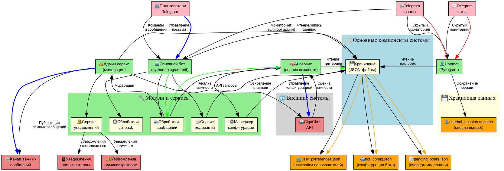
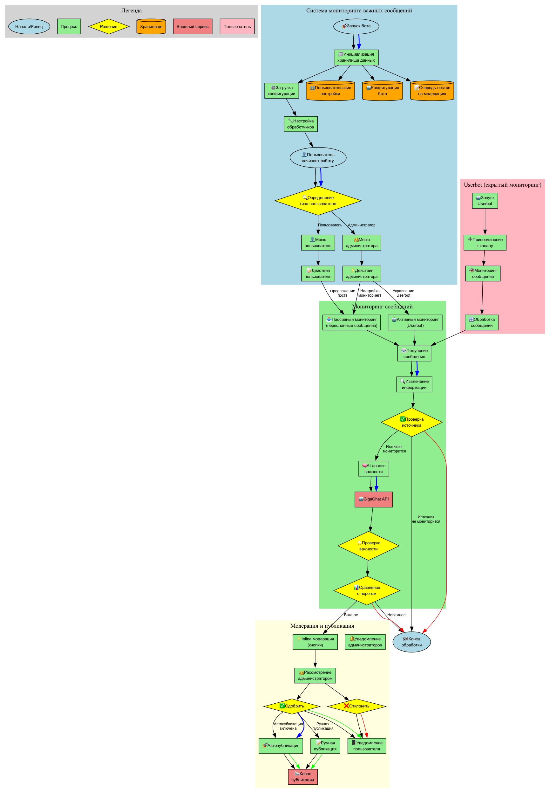
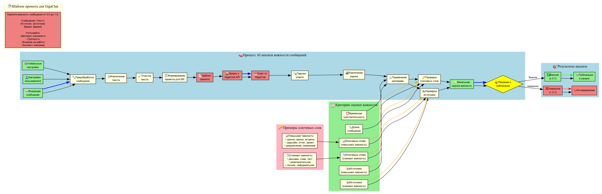
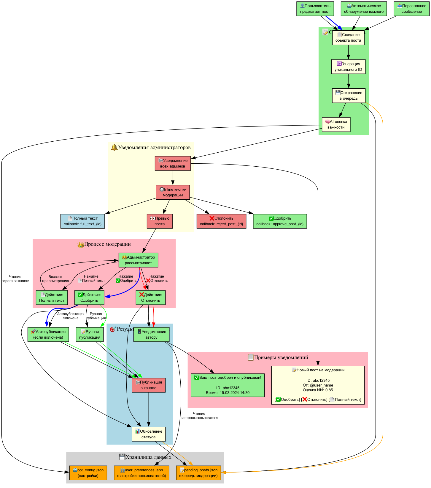

# 🤖 Telegram Bot для мониторинга важных сообщений
## Улучшенная презентация с техническими диаграммами

---

## 📋 Оглавление
1. [Обзор проекта](#обзор-проекта)
2. [Архитектура системы](#архитектура-системы)
3. [Алгоритм работы](#алгоритм-работы)
4. [AI анализ сообщений](#ai-анализ-сообщений)
5. [Процесс модерации](#процесс-модерации)
6. [Ключевые возможности](#ключевые-возможности)
7. [Демонстрация функционала](#демонстрация-функционала)
8. [Преимущества для бизнеса](#преимущества-для-бизнеса)
9. [Технические детали](#технические-детали)
10. [Планы развития](#планы-развития)

---

## 🎯 Обзор проекта

### Проблема
- **Информационный шум**: Сотрудники тонут в потоке сообщений из множества каналов и чатов
- **Пропуск важного**: Критически важная информация теряется среди рутинных сообщений
- **Временные затраты**: До 2-3 часов в день уходит на просмотр всех каналов

### Решение
**AI-powered Telegram бот**, который:
- Автоматически анализирует все сообщения с помощью ИИ
- Выделяет только действительно важные
- Уведомляет о них в едином канале
- Позволяет модерировать контент перед публикацией

---

## 🏗️ Архитектура системы



### Основные компоненты:
- **🤖 Основной бот** (python-telegram-bot) - обработка команд и сообщений
- **👤 Userbot** (Pyrogram) - скрытый мониторинг закрытых каналов
- **🧠 AI сервис** - анализ важности сообщений через GigaChat API
- **👑 Админ сервис** - модерация и управление публикациями
- **💾 Хранилище** - JSON файлы для настроек и данных

### Внешние интеграции:
- **📢 Telegram каналы/чаты** - источники сообщений
- **🤖 GigaChat API** - анализ важности сообщений
- **📤 Канал публикации** - выходной канал для важных сообщений

---

## 🔄 Алгоритм работы



### Основные этапы:
1. **🚀 Инициализация** - загрузка конфигурации и настройка обработчиков
2. **👤 Определение типа пользователя** - администратор или обычный пользователь
3. **📨 Мониторинг сообщений** - пассивный (пересланные) или активный (userbot)
4. **🧠 AI анализ** - оценка важности каждого сообщения
5. **👑 Модерация** - inline модерация с кнопками
6. **📢 Публикация** - автоматическая или ручная публикация важных сообщений

### Два режима мониторинга:
- **📤 Пассивный**: Анализ пересланных сообщений (не требует прав администратора)
- **🤖 Активный**: Скрытый мониторинг через Userbot (для закрытых каналов)

---

## 🧠 AI анализ сообщений



### Процесс анализа:
1. **📨 Получение сообщения** - извлечение текста и метаданных
2. **🔧 Предобработка** - очистка и форматирование текста
3. **📋 Формирование промпта** - создание запроса для GigaChat API
4. **🤖 AI анализ** - отправка запроса и получение оценки
5. **⚖️ Применение критериев** - учет ключевых слов и источников
6. **⭐ Финальная оценка** - итоговая оценка важности (0.0 - 1.0)

### Критерии оценки:
- **📈 Ключевые слова** (повышают важность): срочно, важно, встреча, дедлайн
- **📉 Исключаемые слова** (снижают важность): реклама, спам, тест
- **📢 Источники** - настройка важности по каналам/чатам
- **⏰ Временная чувствительность** - учет времени публикации
- **📏 Длина сообщения** - минимальная и максимальная длина

### Пример промпта для GigaChat:
```
Оцените важность сообщения от 0.0 до 1.0:

Сообщение: {текст}
Источник: {источник}
Время: {время}

Учитывайте:
- Деловую значимость
- Срочность
- Влияние на работу
- Контекст компании
```

---

## 📝 Процесс модерации



### Inline модерация:
1. **📝 Создание поста** - пользователь предлагает пост или бот обнаруживает важное
2. **🆔 Генерация ID** - уникальный идентификатор поста
3. **🧠 AI оценка** - автоматическая оценка важности
4. **🔔 Уведомление админов** - отправка всем администраторам
5. **🔘 Inline кнопки** - мгновенные действия без перехода в меню
6. **👑 Рассмотрение** - одобрение или отклонение
7. **📢 Публикация** - автоматическая или ручная публикация

### Inline кнопки модерации:
- **✅ Одобрить** - сразу публикует пост в канале
- **❌ Отклонить** - отклоняет пост и уведомляет автора
- **📄 Полный текст** - показывает полный текст для длинных постов

### Пример уведомления администратору:
```
📝 Новый пост на модерации

📋 ID поста: abc12345
👤 От пользователя: @user_name
📅 Время: 15.03.2024 14:30
⭐ Оценка ИИ: 0.85

📄 Текст:
Уважаемые коллеги! Напоминаю о важной встрече завтра в 10:00 в конференц-зале. Обсуждаем квартальные результаты. Присутствие обязательно!

[✅ Одобрить] [❌ Отклонить] [📄 Полный текст]
```

---

## 🚀 Ключевые возможности

### 1. Интеллектуальный анализ сообщений
- **GigaChat API** для оценки важности каждого сообщения
- Учет контекста, ключевых слов и источника
- Настраиваемый порог важности (0.0 - 1.0)
- Применение пользовательских критериев

### 2. Два режима мониторинга
- **Пассивный**: Анализ пересланных сообщений
- **Активный**: Скрытый мониторинг через Userbot

### 3. Система модерации
- Предложения постов от пользователей
- Inline-модерация для администраторов
- Автоматическая публикация или ручное одобрение
- Уведомления о результатах модерации

### 4. Гибкая настройка
- Ключевые слова для повышения/понижения важности
- Индивидуальные настройки для каждого пользователя
- Глобальные параметры для администраторов
- Настройка источников мониторинга

---

## 📱 Демонстрация функционала

### 1. Главное меню администратора

**[МЕСТО ДЛЯ СКРИНШОТА: Главное меню администратора]**

*Комментарий: Показывает основные разделы управления ботом. Администраторы имеют доступ к мониторингу, настройке канала публикации, управлению другими администраторами и глобальным настройкам.*

```
Структура меню:
📊 Мониторинг | 📢 Канал публикации
👥 Администраторы | ⚙️ Настройки
🤖 Userbot | ℹ️ Справка
```

---

### 2. Мониторинг источников

**[МЕСТО ДЛЯ СКРИНШОТА: Интерфейс мониторинга с inline кнопками]**

*Комментарий: Раздел для управления отслеживаемыми каналами и чатами. Показывает статистику и позволяет добавлять/удалять источники.*

**[МЕСТО ДЛЯ СКРИНШОТА: Список мониторимых источников]**

*Комментарий: Детальный список всех отслеживаемых каналов и чатов с возможностью удаления.*

---

### 3. Настройка канала публикации

**[МЕСТО ДЛЯ СКРИНШОТА: Интерфейс настройки канала]**

*Комментарий: Администратор может выбрать канал из списка, где бот является администратором, или ввести ID/username вручную.*

**[МЕСТО ДЛЯ СКРИНШОТА: Успешная настройка канала]**

*Комментарий: Подтверждение настройки с информацией о канале и статусе прав бота.*

---

### 4. Управление администраторами

**[МЕСТО ДЛЯ СКРИНШОТА: Список администраторов]**

*Комментарий: Показывает всех администраторов бота с их ID и username. Позволяет добавлять и удалять администраторов через простые команды +ID или -ID.*

---

### 5. Глобальные настройки

**[МЕСТО ДЛЯ СКРИНШОТА: Меню настроек с inline кнопками]**

*Комментарий: Центр управления параметрами бота. Включает настройку порога важности, автопубликации и управление ключевыми словами.*

**[МЕСТО ДЛЯ СКРИНШОТА: Управление ключевыми словами]**

*Комментарий: Интерфейс для добавления важных и исключаемых слов, которые влияют на оценку важности сообщений.*

---

### 6. Userbot для скрытого мониторинга

**[МЕСТО ДЛЯ СКРИНШОТА: Главное меню Userbot]**

*Комментарий: Позволяет запустить скрытый мониторинг закрытых каналов без добавления основного бота.*

**[МЕСТО ДЛЯ СКРИНШОТА: Присоединение к каналу через Userbot]**

*Комментарий: Простой интерфейс для добавления канала в мониторинг - достаточно отправить ссылку.*

---

### 7. Модерация постов (Inline)

**[МЕСТО ДЛЯ СКРИНШОТА: Уведомление админу о новом посте с inline кнопками]**

*Комментарий: Когда пользователь предлагает пост, администраторы получают уведомление с возможностью мгновенно одобрить или отклонить его прямо в чате.*

**[МЕСТО ДЛЯ СКРИНШОТА: Результат одобрения поста]**

*Комментарий: Подтверждение публикации и уведомление автору поста.*

---

### 8. Интерфейс обычного пользователя

**[МЕСТО ДЛЯ СКРИНШОТА: Главное меню пользователя]**

*Комментарий: Упрощенное меню для обычных пользователей с возможностью предлагать посты и каналы.*

```
Структура меню:
📝 Предложить пост | 📢 Предложить канал
📬 Канал важных сообщений | ℹ️ Справка
```

**[МЕСТО ДЛЯ СКРИНШОТА: Интерфейс предложения поста]**

*Комментарий: Пользователь может отправить текст для публикации, который будет рассмотрен администраторами.*

**[МЕСТО ДЛЯ СКРИНШОТА: Просмотр своих предложений]**

*Комментарий: История предложенных постов с их статусами - ожидает, одобрен, отклонен или опубликован.*

---

### 9. Предложение каналов для мониторинга

**[МЕСТО ДЛЯ СКРИНШОТА: Интерфейс предложения канала]**

*Комментарий: Пользователи могут предлагать интересные каналы для добавления в мониторинг.*

**[МЕСТО ДЛЯ СКРИНШОТА: Уведомление админу с inline кнопками для добавления канала]**

*Комментарий: Администратор может одним нажатием добавить предложенный канал в мониторинг.*

---

### 10. Автоматический анализ и публикация

**[МЕСТО ДЛЯ СКРИНШОТА: Пример важного сообщения в публичном канале]**

*Комментарий: Финальный результат - важное сообщение, автоматически выявленное ИИ и опубликованное в едином канале с указанием источника и оценки важности.*

---

## 💰 Преимущества для бизнеса

### Экономия времени
- **До 70%** сокращение времени на мониторинг информации
- **2-3 часа в день** экономии для каждого сотрудника
- Фокус на действительно важных задачах

### Повышение эффективности
- **0% пропущенных** критически важных сообщений
- **Мгновенное реагирование** на важные события
- **Централизованный контроль** информационных потоков

### Масштабируемость
- Неограниченное количество источников мониторинга
- Поддержка множества администраторов
- Индивидуальные настройки для разных отделов

### ROI (Return on Investment)
```
Экономия на 10 сотрудников:
- 2 часа/день × 10 человек = 20 человеко-часов/день
- 20 часов × 22 дня = 440 часов/месяц
- При средней ставке 1000₽/час = 440,000₽/месяц экономии
```

---

## 🔧 Технические детали

### Используемые технологии
- **Python 3.10+** - основной язык разработки
- **python-telegram-bot** - взаимодействие с Telegram API
- **Pyrogram** - для функционала Userbot
- **GigaChat API** - анализ текста и оценка важности
- **Pydantic** - валидация данных
- **JSON Storage** - легковесное хранилище

### Безопасность
- Шифрование токенов и ключей
- Разграничение прав доступа
- Логирование всех действий
- Защита от спама и флуда

### Производительность
- Асинхронная обработка сообщений
- Оптимизированные запросы к API
- Кеширование результатов анализа
- Масштабирование под нагрузку

### Структура проекта
```
important_message/
├── main.py              # Точка входа
├── bot.py               # Основная логика бота
├── ai_service.py        # AI анализ сообщений
├── admin_service.py     # Административные функции
├── userbot.py           # Скрытый мониторинг
├── models.py            # Модели данных
├── config.py            # Конфигурация
├── utils.py             # Утилиты
├── requirements.txt     # Зависимости
└── *.dot               # Диаграммы Graphviz
```

---

## 📈 Планы развития

### Краткосрочные (1-2 месяца)
- [ ] Веб-интерфейс для администрирования
- [ ] Экспорт статистики и отчетов
- [ ] Интеграция с корпоративными системами
- [ ] Мультиязычная поддержка

### Среднесрочные (3-6 месяцев)
- [ ] Machine Learning для улучшения точности
- [ ] Автоматическая категоризация сообщений
- [ ] Планировщик публикаций
- [ ] API для внешних интеграций

### Долгосрочные (6-12 месяцев)
- [ ] Мобильное приложение для администраторов
- [ ] Интеграция с другими мессенджерами
- [ ] SaaS версия для внешних клиентов
- [ ] Аналитика и Business Intelligence

---

## 📊 Метрики успеха

### Текущие показатели
- **Точность определения важности**: 85-90%
- **Время обработки сообщения**: < 2 сек
- **Uptime**: 99.9%
- **Удовлетворенность пользователей**: 4.8/5

### KPI для отслеживания
1. Количество обработанных сообщений/день
2. Процент ложных срабатываний
3. Время реакции на важные события
4. Экономия рабочего времени сотрудников

---

## 🎯 Заключение

### Почему это важно сейчас?
- Экспоненциальный рост информации
- Удаленная работа требует новых инструментов
- Конкуренция за внимание сотрудников

### Что мы получаем?
- **Умный фильтр** информационного потока
- **Единое окно** для важных новостей
- **Контроль** над корпоративными коммуникациями
- **Экономию** времени и денег

### Следующие шаги
1. Развертывание в production
2. Обучение администраторов
3. Пилотный запуск на 1-2 отделах
4. Сбор обратной связи и доработка
5. Масштабирование на всю компанию

---

## 📞 Контакты и поддержка

**Техническая поддержка**: [support@company.com]
**Документация**: [docs.company.com/telegram-bot]
**Обратная связь**: [feedback@company.com]

**Диаграммы и схемы**: См. папку `diagrams/` и файл `DIAGRAMS_README.md`

---

*Спасибо за внимание!* 