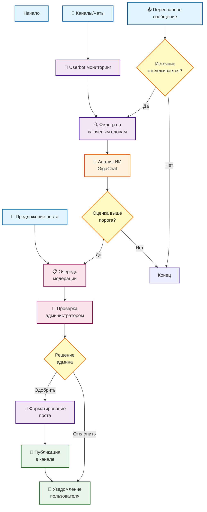

# Промпт для генерации диаграммы алгоритма работы бота

## Техническое задание на создание диаграммы

Создайте блок-схему алгоритма работы Telegram-бота для мониторинга важных сообщений в формате Mermaid или PlantUML.

## Структура диаграммы

### Главная диаграмма - Общий обзор системы
```
1. Три основных входа:
   - Автоматический мониторинг (Userbot)
   - Предложения пользователей
   - Пересланные сообщения

2. Центральный процессор:
   - Анализ ИИ
   - Фильтрация
   - Оценка важности

3. Модерация:
   - Очередь постов
   - Решение администратора

4. Выход:
   - Публикация в канале
   - Уведомления
```

### Поддиаграмма 1 - Процесс автоматического мониторинга
```
Начало → Новое сообщение в источнике
↓
Userbot получает сообщение
↓
Проверка: Источник мониторится?
├─ Нет → Конец
└─ Да ↓
Получение списка пользователей
↓
Для каждого пользователя:
├─ Фильтрация по ключевым словам
├─ Анализ ИИ (оценка 0-1)
└─ Проверка порога важности
    ├─ Ниже порога → Конец
    └─ Выше порога → В очередь модерации
```

### Поддиаграмма 2 - Процесс предложения поста
```
Начало → Пользователь отправляет текст
↓
Запрос подтверждения
├─ Отмена → Конец
└─ Подтвердить ↓
Создание поста в очереди
↓
Уведомление администраторов
↓
Ожидание решения
├─ Одобрить → Публикация
└─ Отклонить → Уведомление автора
```

### Поддиаграмма 3 - Процесс модерации
```
Новый пост в очереди
↓
Уведомление администраторов
↓
Администратор просматривает:
├─ Текст поста
├─ Источник
├─ Оценка ИИ
└─ Время
↓
Решение:
├─ Одобрить
│   ├─ Форматирование
│   ├─ Публикация в канале  
│   └─ Уведомление автора (успех)
└─ Отклонить
    └─ Уведомление автора (отказ)
```

## Пример кода Mermaid для основной диаграммы



## Легенда для диаграммы

### Цвета блоков:
- 🔵 **Голубой** - Действия пользователя
- 🟣 **Фиолетовый** - Автоматические процессы бота
- 🟠 **Оранжевый** - Процессы с ИИ
- 🔴 **Розовый** - Действия администратора
- 🟡 **Желтый** - Точки принятия решений
- 🟢 **Зеленый** - Результаты/Публикация

### Типы стрелок:
- **Сплошная** → Основной поток
- **Пунктирная** ⇢ Альтернативный путь
- **Толстая** ⟹ Критически важный переход

### Временные метки:
- ⚡ Мгновенно (< 1 сек)
- ⏱️ Быстро (1-5 сек)
- ⏳ Ожидание (зависит от человека)

## Дополнительные элементы для понятности

### Примеры на диаграмме:
Добавить сноски с примерами:
- "СРОЧНО: собрание" → Оценка 0.9
- "Продам гараж" → Оценка 0.2
- "Встреча в 15:00" → Оценка 0.7

### Статистика:
Показать типичные значения:
- 80% сообщений отсеивается на этапе ИИ
- 90% предложенных постов одобряется
- Среднее время модерации: 5-30 минут

### Роли и права:
Четко обозначить:
- 👤 **Пользователь**: предлагать посты, добавлять источники
- 🤖 **Бот**: анализировать, фильтровать, уведомлять
- 👮 **Администратор**: одобрять, отклонять, настраивать

## Интерактивные элементы (если поддерживается)

1. **Клик по блоку** → Детальное описание процесса
2. **Наведение на стрелку** → Показ примера данных
3. **Клик по решению** → Критерии принятия решения
4. **Анимация потока** → Визуализация движения данных

## Финальные требования

1. **Простота восприятия** - минимум технических терминов
2. **Полнота информации** - все ключевые процессы
3. **Визуальная иерархия** - важное выделено размером/цветом
4. **Практичность** - можно использовать как инструкцию
5. **Масштабируемость** - легко добавить новые элементы